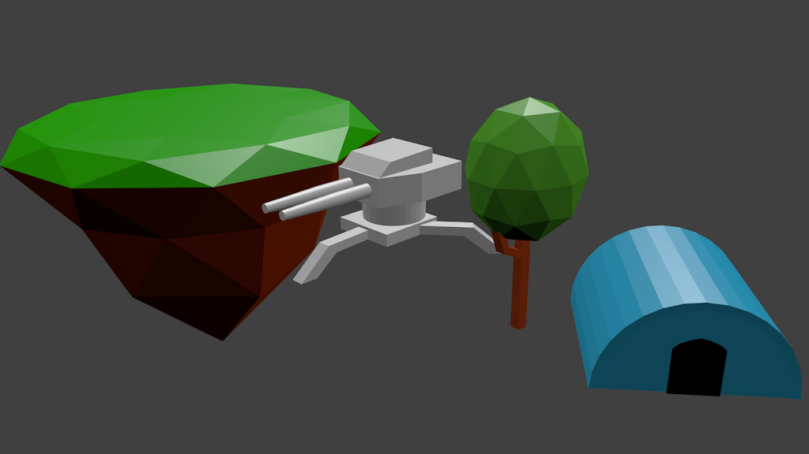
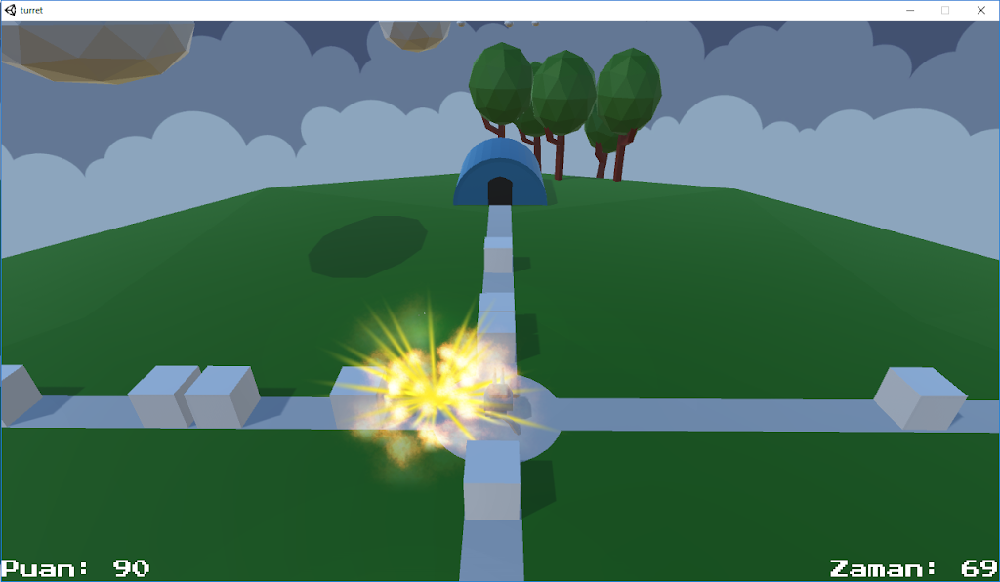

3 gün önce kendime bir iyilik yaptım ve Unity öğrenmeye başladım. Programlama konusunda halihazırda tecrübem bulunduğundan, Unity’e başlamadan önce 4-5 gün kadar Blender dersleri izleyerek az da olsa modelleme öğrendim. Gerçi, yaptığım hiç bir örnek bir oyunda kullanılmaya müsait değildi. Çünkü dersler, sizi oyun yapmanız için değil, kaliteli renderlar almanız için eğitiyor. Fakat arayüze ve kısa yollara alışmam konusunda çok yardımları dokundu. Bir de, önceki yazıda göreceğiniz havluyu çevremdekilere gösterdiğimde duyduğum “E sen şimdi havlunun fotoğrafını niye çektin ki?” cümlesinin verdiği keyif paha biçilemez 🙂 Sözün özü, eğer bir oyun için modelleme yapacaksanız izleyeceğiniz dersleri ona göre seçin.

Şimdi ilk çalışmamın ekran görüntüsünü ve indirme bağlantısını vereyim.

İleriki sürümler de elbette zaman harcar bunları da geliştiririm. Umarım...

[İndirmek İçin Tıkla](https://drive.google.com/file/d/0B01T_59j7QNeMmtyZHBwdWxwMEU/view)

Video



Görmüş olduğunuz proje, birazdan vereceğim referanslar hariç tamamen benim tarafımdan oluşturulmuştur. Hepsi el emeği göz nuru ^^

Referanslar:  
* Simple Particle Pack: <https://www.assetstore.unity3d.com/en/#!/content/3045>  
* Farland Skies: <https://www.assetstore.unity3d.com/en/#!/content/60004>  
* Müzik: Unity Tanks Tutorial

Şimdilik farkında olduğum sıkıntılar:
* Mermileri takip etmesi zor.
* 106 saniyeden fazla dayanmak imkansız (rekorum ^^ ). Zorluk dengelenmeli.
* Tekrar oynamak için oyuncuya sebep sunmuyor. Aslında bu genel olarak tüm oyun geliştiricilerin sıkıntısı. Ufak bir rekabet unsuru genelde çözüm oluyor. Belki karakter gelişimi gibi bir sistem ekleyebilirim. Mesela, öldürülen belirli sayıda düşman için oyuncu yetenek puanı kazanabilir. Bu puanları da atış etme sıklığını arttırmak için kullanabilir. Veyahut zamanı yavaşlatmak gibi tek kullanımlık özellikler eklenebilir
* Ve belki de en önemlisi cafcaflı isim. Zira kimse adı “turret oyunu” olan bir şeyi oynamak istemez ^^

Bitirmeden ekliyeyim, Unity övüldüğü kadar iyi bir motor değil. Bir kaç kez aç-kapa düzelsin tarzında sorunla karşılaştım. Bu tarz bir sorunla yarım saat uğraşıp sonra da tek yapmam gerekenin programı açıp kapatmak olduğunu fark edince, ciddi anlamda moralim bozuldu. Neyse ki Unity hala geliştirilmeye devam eden bir motor ve diğer hiç bir motorun sahip olmadığı kadar geniş bir topluluğa sahip. Ayrıca ben de Unity’i eleştirebilecek bir konumda değilim 🙂 Şimdilik burada gelişmeye devam, belki sonra bir ortam değişikliğine giderim.

Projeye tekrar ne zaman dönerim bilinmez ama ara ara bu tarz günlük yazmak istiyorum. Hem aklımdaki fikirleri derli toplu bir yerde tutmuş hem de iyi kötü yaptığım işleri bir araya toplamış oluyorum. Günlüğün sonraki sayfasına kadar kendine iyi bak ^^

Edit(15.07.2016): Son sürümü denemek için [TIKLA](http://www.cheesegames.net/games/507/index.php?gameDataId=507)