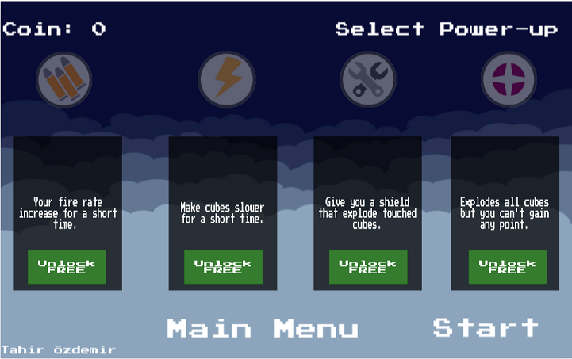
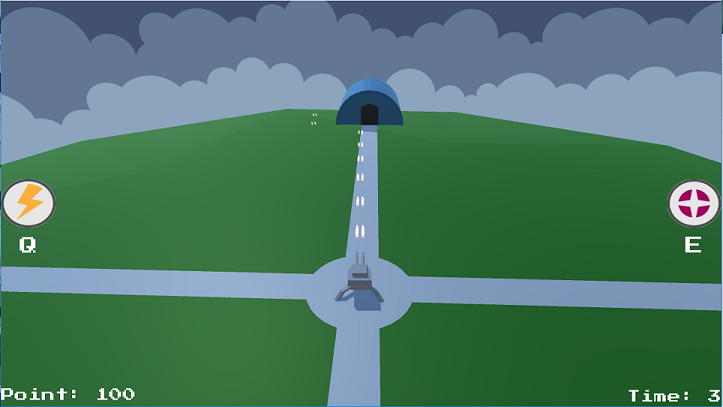

Bitti. Baya baya bitti. Yetenek sistemi tamam. Bir önceki günlükte bahsettiğim iki yeni yeteneğin birini, kısa süreliğine kalkan vereni, ekledim. Son yetenek olarak da mermi hasarını artırmak yerine tüm küpleri patlatan bir yetenek hazırladım. Görselde hepsinin altında “FREE” yazsa da bu sadece ilk açılan için geçerli. Her açtığın yetenek için bir sonrakinin bedeli 150 “coin” artmakta. Önce hangisini açacağın sana kalmış. Aynı anda en fazla iki yetenek seçebilirsin.

Ayrıca, ilk yeteneklerin algoritmalarını da elden geçirirken fark ettiğim önemli “bug”ları düzelttim. Hangi yeteneklerin açıldığını, kaç “coin”in olduğunu kaydedecek sistemi de oluşturdum. Böylece oyunu yeniden açtığında kaldığın yerden devam edebilirsin.

Son WebGL buildini almadan önce butonların altındaki “textbox”ları kapattığımdan görünmese de sol yetenek butonu için “Q”, sağ yetenek butonu için “E” tuşlarını kullanabilirsin. Ana platform Android olduğu için WebGL buildleri öncesi hep açıyordum “textbox”ları ama bu sefer açmayı unutmuşum. İnternet hızım, kaplumbağaların hızıyla yarıştığı için bütün oyunu tekrar yüklemek oldukça sıkıntılı benim açımdan. Ayrıca yüklediğim sitede bu sıralar sorunlar var, 5-6 denemeden sonra anca yükleyebildim. Şöyle görünmesi lazımdı:

Yaklaşık 15 günlük bir projeyi, böylece tamamlamış oluyorum. Belki bundan sonra ufak tefek bir iki düzenleme daha yaparım. Android cihazlarda dönme hızının çok yavaş olduğundan şikayetçi olanlar var, hız çarpanını artırabilirim. Bu süreçte oldukça değerli bilgiler edindim. Unity motorunu bir seviyeye kadar öğrenmiş oldum. Keyifli bir iki haftaydı benim için. Başka bir yazıda/projede görüşünceye kadar, sayonara.

Tarayıcı üzerinden oynamak için [TIKLA](http://www.cheesegames.net/games/507/index.php?gameDataId=507)