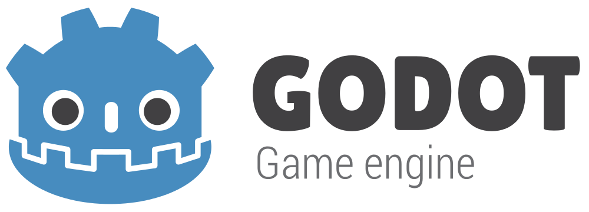

Gerek bireysel gerekse de ufak çaplı gruplar olsun, bağımsız oyun geliştiricisi olmak isteyen herkes, kendilerine bir geliştirme ortamı arıyor. Pek çoğu şu 3 popüler seçenekten biri ile yoluna devam ediyor: Unity, Unreal Engine, Game Maker. Bu yazıda, bu üçü dışında seçebileceğiniz yeni bir oyun motorunu tanıtacağım.

**[Godot](https://godotengine.org/), açık kaynak kodlu ve MIT lisansına sahip bir oyun motoru.** Bu noktada “Nedir bu MIT lisansı?” sorusu akla gelebilir. MIT, uygun bir referans vermeniz halinde, yazılımı istediğiniz gibi kullanma, kopyalama, değişiklik yapma ve hatta satma iznini veren bir açık kaynak yazılım lisansı. Eğer motora eklemek istediğiniz bir özellik varsa, tek yapmanız gereken, GitHub üzerinden C++ ile yazılmış kaynak dosyasını indirmek, ilgili değişikleri yapmak ve derlemek. Sonrasında isterseniz, bu özelliği toplulukla paylaşabilir ya da paraya dönüştürebilirsiniz.

Unity ve Unreal Engine gibi programlardan ayrıldığı bir diğer nokta ise, **yaptığınız satış sonrası sizden herhangi bir yüzde talep etmemesi.**Oyununuzun ne kadar sattığı ya da sizin ne kadar kâr elde ettiğiniz önemli değil. Derseniz ki ben çok kazandım maddi olarak destek olmak istiyorum, **bağış sayfasından katkıda bulunmanız her zaman için mümkün.**

Biraz da motorun teknik özelliklerine bakalım. Godot, **hem iki hem de üç boyutlu** oyunlar geliştirmenize olanak sağlayan bir yazılım. İki boyutlu oyunlar için, **dâhili bir fizik motoru sunuyor.** Box2D gibi açık kaynak kodlu ve yine C++ ile geliştirilmiş hazır bir fizik motoru yerine, neden kendileri yeni bir tane daha yazmışlar bilmiyorum ama kendi yaptığım testlerde gayet güzel çalıştığını söyleyebilirim. Üç boyutlu oyunlar için ise, popüler modelleme programları olan, **3DS Max, Maya ve Blender’a tam destek veriyor.** Fizik tabanlı render desteğinin, 2016 sonlarına doğru geleceği söylense dahi**, HDR, köşe yumuşatma gibi temel fonksiyonlara sahip.** Ayrıca hem iki hem de üç boyut için dâhili bir de **animasyon sistemi var.** Bir oyun objesinin hemen hemen her özelliğini kontrol etmenize olanak sağlayan bu sistem, oldukça güzel hazırlanmış. **İki boyutlu görselleriniz için “iskeletleme” özelliği dahi sunuyor.**

Godot’un geliştiricileri, **GDScript** adında kendi ürettikleri, **Python benzeri bir betik dili** sunuyorlar bize. Öğrenmesi ve kullanması oldukça rahat bir dil olduğunu söyleyebilirim. Kendi iddiaları, bir saatten daha kısa bir sürede, bu dile alışılabileceği yönünde. Ayrıca, GDScript’i kullanmak için harici bir derleyici kullanmanıza gerek yok. Tıpkı Game Maker’da olduğu gibi, **kod yazma işi de motorun kendi ara yüzüne gömülü. Metin tamamlama, kelime bulma, değiştirme, parametre önerme gibi kodlama sürecini hızlandıracak temel özelliklere sahip.** Ayrıca, şu an geliştirilmekte olan **2.2 sürümüyle birlikte, C# desteğinin** ekleneceğini de belirteyim.

Godot, hem çalışma hem de çıktı verme olarak, pek çok platformu destekliyor. **Windows, OS X ve Linux** üzerinde çalışabilen program, **iOS, Android, Windows, OS X, Linux ve HTML 5 için çıktı verebilmekte.** Ayrıca, motorun kendisi **20 megabayt** gibi oldukça ufak boyuta sahip. Yani, hemen şuan indirip denememek için hiçbir sebebiniz yok. Son olarak, **kalabalık sayılabilecek bir topluluğu olduğunu** da belirteyim. Sorduğum soruya iki dakika içerisinde yanıt alabilmek, Godot benzeri ufak motorlar için sık rastlanır bir durum değil.

Tüm bu özelliklerin yanında, **eklenti mağazası, performans test aracı** gibi bahsetmediğim daha pek çok irili ufaklı özelliği bulunan **Godot, şuan 2.1 sürümünde.** Gün geçtikçe yeni özellikler eklenmeye ve var olanlar da geliştirilmeye devam ediyor. Eğer siz de yeni bir oyun motoru denemek istiyorsanız, **Godot’a bakmadan geçmeyin derim.** Gerek topluluğu, gerekse de kendi sitesi üzerinden ulaşabileceğiniz dokümantasyonları sayesinde, kısa sürede kendi uygulamalarınızı geliştirmeye başlayabilirsiniz.