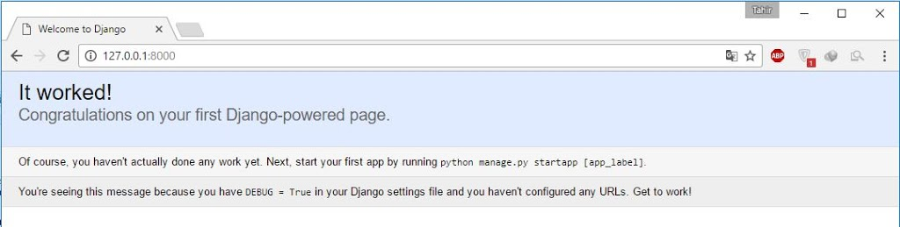

[Django](https://www.djangoproject.com/), tamamen ücretsiz ve açık kaynak bir [Python](https://www.python.org/) web frameworküdür. Geliştirme sürecini oldukça hızlandırmasıyla öne çıkmaktadır. >Django’yu sisteminize kurmanız için tek yapmanız gereken, Python yüklü bir sistemde komut satırına şu kodu girmek:
```
pip install Django
```

Şimdi Django ile basit bir web uygulamasının nasıl geliştirildiğine bakalım. Öncelikle konsolu açıyoruz ve “cd” komutu ile projeyi oluşturmak istediğimiz dizine geçiyoruz. Örnek olarak masaüstüne helloapp adında bir klasör oluşturalım ve “cd Desktop/helloapp” ile o klasöre geçelim. Akabinde şu kod ile ilk projemizi başlatıyoruz:
```
django-admin startproject helloapp
```

Bu komutun sonunda yer alan “helloapp” bizim oluşturacağımız projenin adı oluyor. Şuna benzer bir klasör yapımız olacak:
```
helloapp
├─helloapp
│   ├── __init__.py
│   ├── settings.py
│   ├── urls.py
│   └── wsgi.py
└── manage.py
```

Bu ağaca baktığınızda içeride oluşturulmuş olan manage.py adında bir dosya ve “helloapp” adında bir klasör göreceksiniz. Bu, sizin proje ayarlarınızı (setting.py) ve projenizdeki “rotaları” (urls.py) içeren ana proje klasörünüz. Şimdi ayarlarla biraz oynayalım. Herhangi bir editörle (not defteri dahi olur) settings.py’ı açalım ve INSTALLED_APPS kısmını bulalım. Şöyle bir şeye benzemeli:  
```python {linenos=table}
INSTALLED_APPS = [
         'django.contrib.admin',
         'django.contrib.auth',
         'django.contrib.contenttypes',
         'django.contrib.sessions',
         'django.contrib.messages',
         'django.contrib.staticfiles'
]
```

Django, “app”ler üzerinden çalışır. Bir app, kendi başına işletilebilen kod birimlerinden meydana gelir ve bir websitesinin göstermekten tutun da kullanıcı yetkilerinin yönetilmesine kadar pek çok şeyi yapabilir. Django projenizi ilk oluşturduğunuzda, bir takım appler ön tanımlı olarak gelir. Bu liste, şimdilik o ön tanımlı gelenlerden oluşuyor. Programcı, kendi yarattığı her appi kullanabilmek için bu listeye eklemek zorundadır. Şimdi nasıl yeni bir app yaratacağımıza bakalım.

Django’da her app MTV (Model, View, Template) yapısına sahiptir. Kısaca bahsetmek gerekirse, bir app verileri “model”den alır, “view” bu veriyi işler ve bir “template”i işlenmiş veri ile birlikte ekranda gösterir. Kafanız karıştıysa korkmayın ve okumaya devam edin. İlgili kısımlara geldiğimizde daha iyi anlayacağınızı düşünüyorum.

Yeni bir app yaratmak için komut satırında helloapp klasöründe iken şu komutu giriyoruz

```
python manage.py startapp firstapp
```

Artık “firstapp” adında bir uygulamamız var. Proje ağacımız şöyle olmalı:

```
helloapp
├── helloapp
│        ├── __init__.py
│        ├── settings.py
│        ├── urls.py
│        └── wsgi.py
├── firstapp
│        ├── __init__.py
│        ├── admin.py
│        ├── apps.py
│        ├── migrations
│        ├── models.py
│        ├── tests.py
│        └── views.py
└── manage.py
```

Oluşturduğumuz yeni uygulamanın Django tarafından tanınması için settings.py içerisinde bulunan uygulamalar listemize ekliyoruz:

```python {linenos=table}
INSTALLED_APPS = [
         'django.contrib.admin',
         'django.contrib.auth',
         'django.contrib.contenttypes',
         'django.contrib.sessions',
         'django.contrib.messages',
         'django.contrib.staticfiles',
         'firstapp'
]
```

Tebrikler. İlk uygulamanızı oluşturdunuz. Bunun ardından isterseniz her şeyin yolunda gittiğinden emin olmak için serverı çalışır hale getirelim. Konsola şu komutu giriyoruz:

```
python manage.py runserver
```

Şöyle bir çıktı almalıyız:

```
Performing system checks...
until you apply the migrations for app(s): admin, auth, contenttypes, sessions.
Run 'python manage.py migrate' to apply them.
January 26, 2017 - 00:00:02
Django version 1.10.5, using settings 'helloapp.settings'
Starting development server at http://127.0.0.1:8000/
Quit the server with CTRL-BREAK.
```

Eğer biraz dikkatli bakarsanız yapmamız gereken “migration”lar olduğunu söyleyen bir uyarı aldığımızı görebilirsiniz. Şimdilik bu uyarıyı görmezden gelebiliriz. Konsolu açık bırakıp web tarayıcımızı açıyoruz ve adres satırına 127.0.0.1:8000 yazıp, ilgili sayfayı açıyoruz. Eğer şu ana kadar bir hata yapmadıysanız şuna benzer bir sayfanın sizi karşılaması lazım:



Şimdi bu yeni oluşturduğumuz uygulama ile biraz oynayalım. “firstapp” klasöründeki views.py dosyasını açıyoruz ve içini şöyle değiştiriyoruz:

```python {linenos=table}
from django.shortcuts import render
from django.http import HttpResponse
def index(request):
    return HttpResponse("<h2>HEY!</h2>")
```

Sonrasında firstapp klasörü içerisinde bir urls.py dosyası oluşturuyoruz. Bunun için diğer dosyalardan bir tanesini kopyalayıp adını değiştirebilirsiniz. urls.py dosyasının içeriğini de şu hale getiriyoruz:

```python {linenos=table}
from django.conf.urls import url
from . import views

urlpatterns = [
    url(r'^$', views.index, name='index'),
]
```

Adres satırında bulunan ifade, urlpatterns içinde aranacak ve bulunduğunda views içerisindeki ilgili kod çağrılacak. Burada aranacak tek eşleşme ^$. ^ sembolü bir stringin başlangıcını temsil ederken $ ise sonunu göstermekte. Bizim yazdığımız r’^$’ ifadesi boş olacak ve bu url anasayfamız gibi çalışacak. Sorun şu ki, bu urls.py dosyası bizim yazdığımız firstapp’e ait ve bizim asıl uygulamamız olan helloapp’den ona bir bağlantı yok. Şimdi bu bağlantıyı kuralım. Bunun için helloapp klasöründe bulunan urls.py’ı açıyoruz ve içeriğini şöyle güncelliyoruz:

```python {linenos=table}
from django.conf.urls import url,include
from django.contrib import admin 
urlpatterns = [ 
    url(r'^admin/', admin.site.urls), 
    url(r'^firstapp/', include('firstapp.urls')), 
]
```

Eğer komut satırında serverımız hala çalışıyorsa, tarayıcımızın adres satırına “127.0.0.1:8000/firstapp” yazarak oluşturduğumuz siteye ulaşabiliriz. Şöyle görünmeli:


Eğer bu firstappi sitemizin ana sayfası yapmak istersek tek yapmamız gereken, helloappin urls.py dosyasını şu şekilde güncellemek:

```python {linenos=table}
from django.conf.urls import url,include
from django.contrib import admin
urlpatterns = [
    url(r'^admin/', admin.site.urls),
    url(r'^$', include('firstapp.urls')),
]
```

Mantığı anladığınızı düşünüyorum. Şimdi bir adım daha öteye gidelim. firstapp klasörü içerisine “templates” adında bir klasör oluşturalım. Ardından da index.html ve about.html adındaki şu iki html dosyasını oluşturalım:

index.html:

```html {linenos=table}
<!-- firstapp/templates/index.html -->

<html>
    <head>
        <meta charset="utf-8">
        <title>HEY!!</title>
    </head>
    <body>
        <h1>Django Öğreniyorum.</h1>
  <a href="/about/">Hakkımda</a>
    </body>
</html>
```

about.html:

```html {linenos=table}
<!-- firstapp/templates/about.html -->

<html>
    <head>
        <meta charset="utf-8">
        <title>HEY!</title>
    </head>
    <body>
        <h1>Hakkımda Sayfama Hoşgeldin!</h1>
    <p>
    Hakkımda ıvır zıvır bilgiler.
    </p>
    <a href="/">Ana sayfaya dön</a>
    </body>
</html>
```

Sonrasında firstappin views.py dosyasını şu şekilde güncelleyelim:

```python {linenos=table}
from django.shortcuts import render
from django.views.generic import TemplateView

class HomePageView(TemplateView):
    def get(self, request, **kwargs):
        return render(request, 'index.html', context=None)

class AboutPageView(TemplateView):
    template_name = "about.html"
```

Burada ilk kısımda index.html sayfasını göstermek için bir get fonksiyonu yazdık ve index.html dosyasını bir Django fonksiyonu olan render fonksiyonuna parametre olarak yolladık. İkinci kısımda ise aynı işi yapmak için yine Django’ya ait olan TemplateView’in template\_name parametresine atama yaptık. Her iki method da bir html dosyasını kullanıcıya göstermek için kullanılabilir. Geriye ana uygulamamız olan helloappin urls.py dosyasını değiştirmek kaldı. Şu şekilde güncelleyelim:

```python {linenos=table}
from django.conf.urls import url
from firstapp import views
urlpatterns = [
    url(r'^$', views.HomePageView.as_view()),
    url(r'^about/$', views.AboutPageView.as_view()),
]
```

Bu değişiklikten sonra firstappin urls.py dosyası ile olan bağımız tekrar koptu doğal olarak ama artık tüm olayı helloappin urls.py üzerinden kontrol ettiğimiz için bir sorun olamayacak. Zaten ikinci satırda yer alan import işlemi bizim firstappin viewsine ulaşmamızı sağlıyor ve biz de doğrudan ilgili kod bloklarını helloappin urls.py’ından çağırabiliyoruz. Böylece farklı programlama senaryolarını da görmüş olduk. Yaptığımız değişiklikleri şimdiye kadar dikkatli bir şekilde takip ettiyseniz yaptığımız şey aslında tarayıcının adres satırında yazan bağlantıya göre yazdığımız kodlardan ilgili kısımları çağırmak. Eğer şu ana kadar sorun yoksa 127.0.0.1:8000’i tarayıcımızdan açtığımızda (tabi konsoldan serverimizi çalışır hale getiriyoruz) şu sayfanın bizi karşılaması lazım:


Hakkımda butonu ise şu sayfaya yönlendirmeli:


Oldukça uzun bir yazı oldu ama artık Django üzerinde çalışan bir siteye sahibiz. Tabi ki yapabileceklerimiz bunlarla sınırlı değil. [Buraya](http://tahirozdemir34.pythonanywhere.com/) tıklayarak Django ile oluşturduğum basit blog sitesini inceleyebilirsiniz (tabi hala aktifse) Ayrıca, [GitHub](https://github.com/tahirozdemir34/FirstDjangoWebSite) hesabımda yer alan proje halini indirebilirsiniz. [PythonProgramming.net](https://pythonprogramming.net/django-web-development-with-python-intro/) üzerindeki dersleri takip ederek yaptığımı da belirteyim. Bir sonraki yazıda görüşmek üzere.