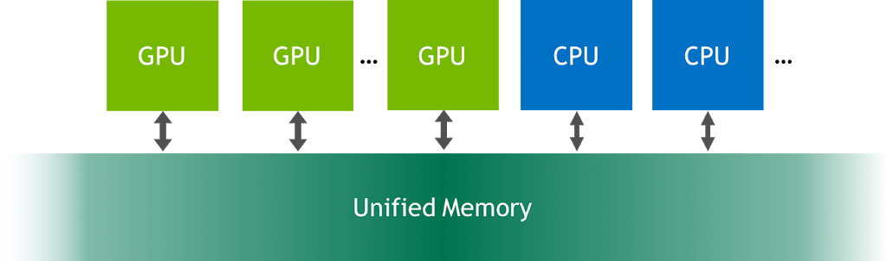
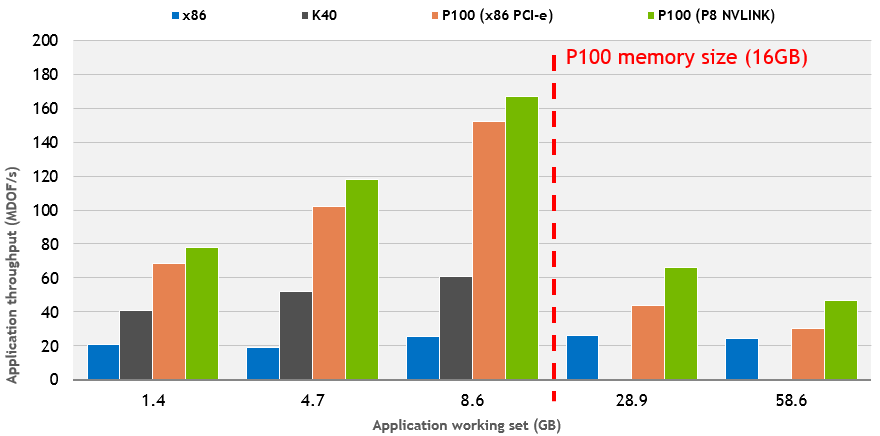

Daha önce [CUDA için ufak bir giriş yazısı](https://www.tahirozdemir.com/2018/09/cuda-icin-temel-bilgiler/) yazmış ve bazı temel bilgileri aktarmaya çalışmıştım. Bu yazıda ise bence CUDA’da yazılım geliştirme işini oldukça kolaylaştıran Unified Memory kavramından ve getirdiği kolaylıklardan bahsedeceğim. Tıpkı önceki yazıda olduğu gibi çok detaya inmeden temel noktalardan bahsetmeye çalışacağım. İşin daha da detayına girmek isteyenler yazının içerisindeki ve sonundaki bağlantılardan faydalanabilir.



Unified Memory aslında sistemdeki her işlemci tarafından erişilebilen bir bellek adres uzayı. Bu teknoloji sayesinde, yazılan uygulamalar hem CPU hem de GPU üzerinden erişilebilecek veriler oluşturabiliyorlar. Normalde verileri oluşturmak için CPU tarafında "malloc()" ya da "[cudaMallocHost()](https://docs.nvidia.com/cuda/cuda-runtime-api/group__CUDART__MEMORY.html#group__CUDART__MEMORY_1gab84100ae1fa1b12eaca660207ef585b)", GPU tarafında ise "[cudaMalloc()](https://docs.nvidia.com/cuda/cuda-runtime-api/group__CUDART__MEMORY.html#group__CUDART__MEMORY_1g37d37965bfb4803b6d4e59ff26856356)" fonksiyonlarını kullanıyorduk. Unified Memory’e geçmek için tek yapmamız gereken verilerimizi "[cudaMallocManaged()](https://docs.nvidia.com/cuda/cuda-runtime-api/group__CUDART__MEMORY.html#group__CUDART__MEMORY_1gd228014f19cc0975ebe3e0dd2af6dd1b)" fonksiyonuyla oluşturmak.:

```
cudaError_t cudaMallocManaged(void** ptr, size_t size);
```

Bir kod parçası, ister CPU tarafında ister GPU tarafında, bu yöntemle ister oluşturulmuş veriye erişmek istediğinde ilgili bellek sayfaları (memory pages) ilgili belleklere taşınır (migration). Ufak bir not: Pascal ve sonraki mimarilerden birine sahip GPU’larda bu işlem donanım seviyesinde desteklenirken, Kepler ve Maxwell mimarilerinde daha kısıtlı bir Unified Memory desteği bulunmakta.
 
Eski mimarilerde cudaMallocManaged() kullanıldığında veriler doğrudan GPU üzerinde oluşturuluyor. Doğal olarak bu verilere ilk olarak CPU üzerinden erişilecekse önce taşınmaları gerekiyor. bu da demek oluyor ki fazladan bir taşıma işlemi daha gerçekleştiriyoruz. Bir diğer sıkıntı da bu eski mimarilerde "page fault" mekanizmasının olmaması. Yani elinizde yüzlerce hatta binlerce elemanlı bir diziniz varsa ve bu dizi hali hazırda CPU üzerinde bulunuyorsa, GPU tarafından sadece bir elemanına erişmek isteseniz dahi tüm dizinin GPU belleğine taşınması gerekmekte. "Unified Memory" kullanmadığımız eski uygulamalarda da bu işlem böyle gerçekleşecekti zaten; Unified Memory’nin buradaki tek katkısı bu taşıma işlemini arka planda otomatik olarak gerçekleştirmesi ve bizim bu işlemle bizzat uğraşmak zorunda olmamamız. Aksi halde "[cudaMemCpy()](https://docs.nvidia.com/cuda/cuda-runtime-api/group__CUDART__MEMORY.html#group__CUDART__MEMORY_1gc263dbe6574220cc776b45438fc351e8)" vasıtası ile tüm taşıma işlerini bizim yapmamız gerekirdi.

Pascal ve sonraki mimarilerde ise Unified Memory asıl gücünü sergileyebiliyor. Az önce bahsettiğim "page fault" durumu bu mimarilerde mevcut. Siz bir dizinin sadece bir elemanına erişecekseniz, sadece o verinin ait olduğu bellek sayfası ilgili donanımlar arasında taşınıyor. Bellek operasyonlarının asıl darboğazı oluşturduğunu düşünürsek, gereksiz verilerin taşınmasından kurtulmak performans üzerinde gerçekten bir fark yaratıyor. Ayrıca "cudaMallocManaged()" fonksiyonu bu mimarilerde veriyi doğrudan herhangi bir donanımda oluşturmuyor. İlk erişim hangi donanımdan yapılırsa veri orada oluşturuluyor. Böylece olası bir gereksiz veri taşıma işleminden daha kurtulmuş oluyoruz. Eğer veri üzerinde biraz daha güç sahibi olmak isterseniz "[cudaMemAdvise()](https://docs.nvidia.com/cuda/cuda-runtime-api/group__CUDART__MEMORY.html#group__CUDART__MEMORY_1ge37112fc1ac88d0f6bab7a945e48760a)" ve "[cudaPrefetchAsync()](https://docs.nvidia.com/cuda/cuda-runtime-api/group__CUDART__MEMORY.html#group__CUDART__MEMORY_1ge8dc9199943d421bc8bc7f473df12e42)" fonksiyonları işinize yarayabilir. Örneğin "cudaMemAdvise()" ile bir veriyi genellikle okuyacağınızı belirtebilirsiniz. Böylece CUDA sistemi sizin için veriyi düzenleyip sizin veriye daha hızlı ulaşmanızı sağlayabilir. ya da "cudaPrefetchAsync" ile zaten tamamına erişeceğiniz veriyi doğrudan ilgili donanıma taşıyarak sistemin sürekli "page fault" üretmesini engelleyebilirsiniz.

  
Şekil 1: Veri büyüklüğüne göre uygulama performans grafiği.

Unified Memory’nin, "page falut" mekanizması sayesinde, sağladığı bir diğer avantaj ise GPU’nuzun belleğine sığmayan verilerle de işlem yapabilmenizi mümkün kılması. Ancak unutmamak gerekir ki veriniz GPU’nun bellek limitini aştığında her ne kadar işlem yapabilmeye devam etseniz de "page fault"tan oluşacak kayıp hala canınızı sıkabilir. Şekil 1’de veri büyüklüğünün P100’ün kapasitesini aştığında oluşan kaybı görebilirsiniz. Öte taraftan Unified Memory olmadan P100’de bu işlemleri gerçekleştiremezdik. Şu halde bir noktaya kadar hala test için kullanılan CPU’dan daha performanslı olduğunu söyleyebiliriz.

Konu hakkında daha derine inmek isterseniz şu yazıları/makaleleri okuyabilirsiniz:  
1- [Unified Memory for CUDA Beginners](https://devblogs.nvidia.com/unified-memory-cuda-beginners/) (Benim yazım da ağırlıklı olarak bu bağlantıdaki bilgilerden oluşmakta)  
2- [Beyond GPU Memory Limits with Unified Memory on Pascal](https://devblogs.nvidia.com/beyond-gpu-memory-limits-unified-memory-pascal/)  
3- [Maximizing Unified Memory Performance in CUDA](https://devblogs.nvidia.com/maximizing-unified-memory-performance-cuda/)  
4- [CUDA C Proglamlama Rehberi, Unified Memory Başlığı](https://docs.nvidia.com/cuda/cuda-c-programming-guide/index.html#um-unified-memory-programming-hd)  
5- [An Investigation of Unified Memory Access Performance in CUDA](https://www.researchgate.net/publication/281409395_An_Investigation_of_Unified_Memory_Access_Performance_in_CUDA)  
6- [An Evaluation of Unified Memory Technology on NVIDIA GPUs](https://hpc.sjtu.edu.cn/ppmm15_uma.pdf)