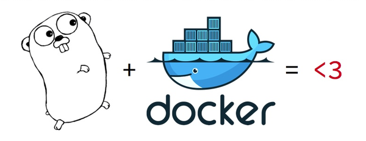

Merhabalar sevgili okur. Başlıkta da görüldüğü üzere bu yazıda Go uygulamamızı nasıl küçük boyutlu bir Docker konteyneri içine sıkıştırabileceğimizden bahsedeceğim.

  Go + Docker = ❤[[\*]](https://hackernoon.com/golang-docker-microservices-for-enterprise-model-5c79addfa811)

Öncelikle bu ihtiyacımın nereden çıktığına bakalım. Geçenlerde GitHub repolarımdaki markdown dosyalarını daha rahat yönetmek için çok çok basit ve bolca "sphagetti code" içeren bir uygulama yazdım. Siz Go Report Card’ın kod kalitesine A+ verdiğine bakmayın 🙂 Şuradan projeyi inceleyebilirsiniz: <https://github.com/tahirozdemir34/GoMarkdownPusher>

Temel CRUD operasyonlarını bu uygulama üzerinden yürütebilmekteyim. Amaç, uygulama geliştirmenin çok yabancısı olduğum web tarafında ortaya çalışabilen bir uygulama koymaktı. Bunu yaparken de ihtiyacım olan bir şey yapmak istedim sadece. Sonra da neden Docker image’ini de oluşturmayım dedim. DockerHub’da bulunan image’leri daha önce kullanmış olsam da kendi image’imi hiç oluşturmadığımdan benim için hep elimi kirletmek istediğim bir konuydu. Böyle olunca da kendimi bu konuda buldum. Yeterince arkaplan sunduğumuza göre asıl mevzumuza gelebiliriz.

### "Multi-stage Build"

Bu kavram, küçük boyutlu konteynerler oluşturabilmemizin arkasındaki sır. Temelde yaptığımız şey uygulamamızı derlemek için bir ara konteyner kullanmak. Benim oluşturduğum "Docker" dosyası şöyle:



İlk olarak Go uygulamamızı derleyeceğimiz ara image’i oluşturdum. Bunun için ‘golang:latest’ image’ini temel olarak aldım. Sonra uygulamamda kullandığım iki kütüphaneyi, [OAuth](https://github.com/golang/oauth2) ve [go-github](https://github.com/google/go-github), kurdum. Daha sonra ise uygulamanın dosyalarını kopyalayıp derleme işlemini gerçekleştirdim.

İkinici FROM’dan itibaren ise uygulamanın çalışacağı image’i hazırladım. Temel image olarak Alpine’ı tercih ettim. Kendisi 5mb’cık olup temel Linux kütüphanelerini içeriyor sadece. Eğer uygulamanın çalışacağı ortamı daha da özelleştirmek isterseniz temel image olarak Scratch’i de tercih edebilirsiniz. 14. satırda gördüğünüz '\-\-from=0' ifadesi ilk image’den dosyaları alacağımı belirtiyor. Orada derleyip hazırladığımız dosyaları yeni image aldım. 15. satırda ise uygulamı başlatıyorum.

Eğer bu ikinci aşamayı yapmasam ve uygulamamı derlediğim image içerisinde çalıştırmak isteseydim, image’imin boyutu 800 küsür MB olacak iken multi-stage build ile uygulamamı 18.9 MB’a sığdırmış oldum.


Şimdi tek yapmamız gereken GitHub repomuz ile DockerHub repomuzu ilişkilendirerek otomatik derlemenin tadını çıkarmak. Nasıl mı?

### Bonus: Github Reponuzdan DockerHub’a Otomatik Derleme

Uygulamamızın kaynak dosyalarını ve uygulamayı içerecek image’i oluşturacak Docker dosyamızı Github repomuza yükledikten sonra bir kaç basit adımda bu işlemi gerçekleştirmek mümkün. Öncelikle gidip DockerHub’da yeni bir repo yaratıyoruz. Repo oluşturma esnasında GitHub ikonuna tıklayıp hangi repomuz ile ilişkilendireceğimizi seçmek yeterli.


Eğer daha önce GitHub hesabınızı bağlamadıysanız sizden erişim için izin isteyecektir. Tüm bunları ayarladıktan sonra ilk derlemeyi elle tetikleyebilirsiniz. Bundan sonra GitHub reponuza yaptığınız her ‘push’ işlemi Docker image’inizin tekrar derlenmesini sağlayacaktır. Detaylara inerek bu otomatik derleme işlemini de özelleştirmeniz ve kurallar tanımlamanız mümkün.


Buraya kadar her şey çok güzel. GitHub ve DokcerHub repomuzu ilişkilendirdik. Bundan sonra uygulamamızın en güncel image’i her zaman DockerHub’da bulunacak. Peki sunucuda konteyner içerisinde çalışan uygulamamızı otomatik güncellememizin bir yolu yok mu? Tabii ki var.

### Bonus 2: Watchtower ile Otomatik Konteyner Güncelleme

Watchtower sizin için konteynerlerinizi takip eden ve otomatik güncelleyen bir uygulama. Kendisi de bir konteyner içerisinde çalışıyor. Tek yapmanız gereken terminalde şu komutu çalıştırmak:

```bash {linenos=table}
docker run -d \     
  --name watchtower \     
  -v /var/run/docker.sock:/var/run/docker.sock \
  containrrr/watchtower \     
  konteyner_adi_1 konteyner_adi_2 ...
```

Watchtower belirli aralıklarla DockerHub’daki image’i kontrol eder. Eğer daha güncel bir sürüm olduğunu fark ederse çalışan konteynerinizi kapatır ve daha önce kullandığınız parametreler ile yeni sürümü barındıran konteyneri ayağa kaldırır. Kaç saniyede bir kontrol edeceğini "-i" parametresi ile verebilirsiniz. Ya da "-s" parametresi ile Cron formatında çizelge ayarlayabilirsiniz. Arguman listesini incelerseniz yapılabilecek pek çok ince ayar olduğunu göreceksiniz. Örneğin, bence ‘–label-enable’ ile kullanımı oldukça kullanışlı. Bu sayede sonradan ayağa kaldıracağınız herhangi bir konteyneri

```bash {linenos=true}
docker run -d --label=com.centurylinklabs.watchtower.enable=true someimage
```

şeklinde çalıştırmanız, o konteynerin Watchtower tarafından takip edilmesi için yeterli oluyor \[[\*\*](https://containrrr.github.io/watchtower/container-selection/)\].

Umarım faydalı bir yazı olmuştur. Her zaman olduğu gibi yararlandığım kaynakları şuraya bırakayım. Konu hakkında daha detaylı bilgiye bu bağlantılardan ulaşabilirsiniz:

1- [Multi-stage Builds](https://docs.docker.com/develop/develop-images/multistage-build/) (Docker dokümanında multi-stage derleme anlatımı)

2- [Automated Builds](https://docs.docker.com/docker-hub/builds/) (Docker dokümanında otomatik derleme anlatımı)

3- [Watchtower](https://containrrr.github.io/watchtower/) (Watchtower dokümantasyonu)